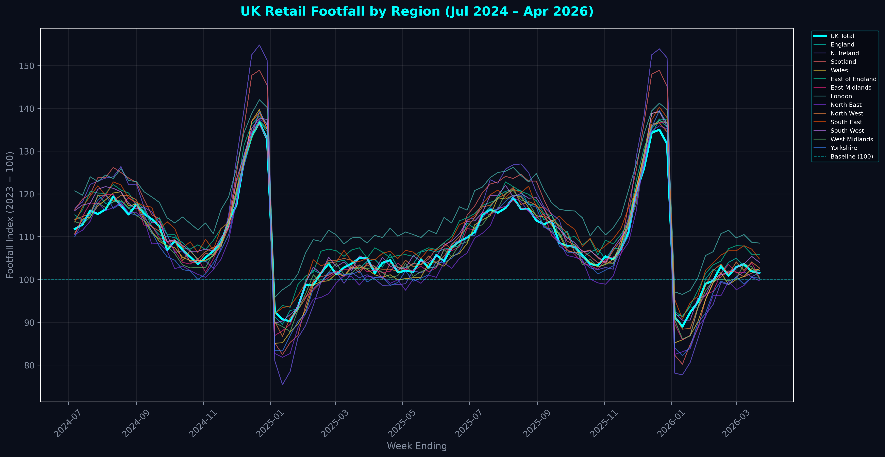
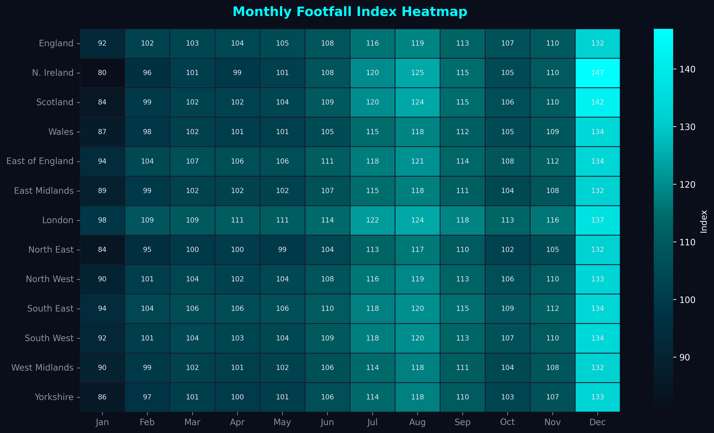
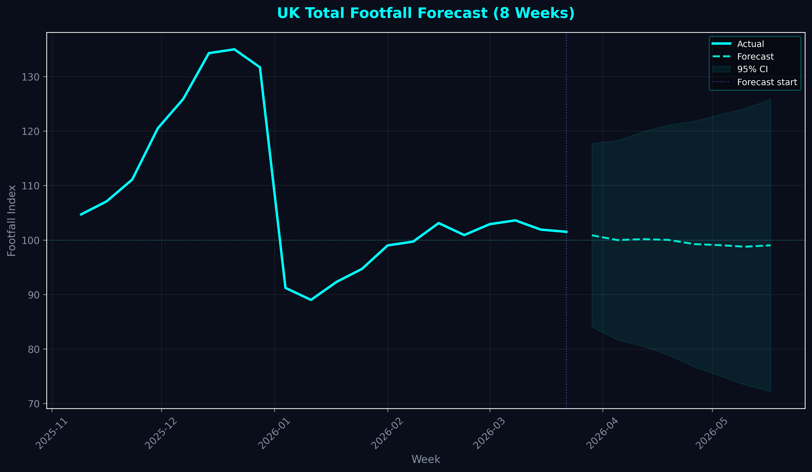
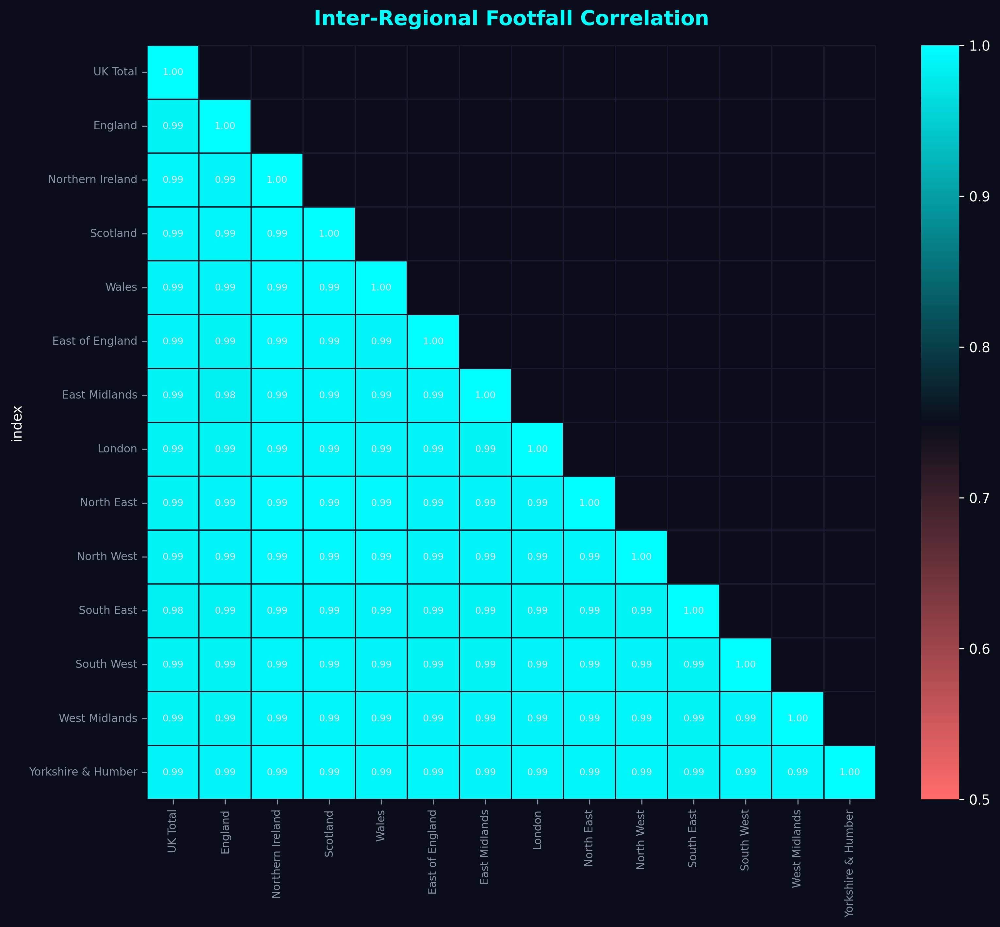
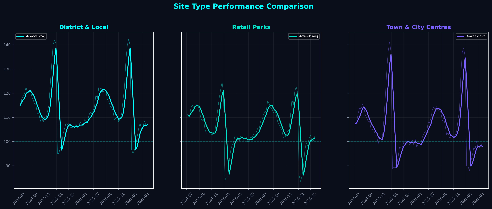
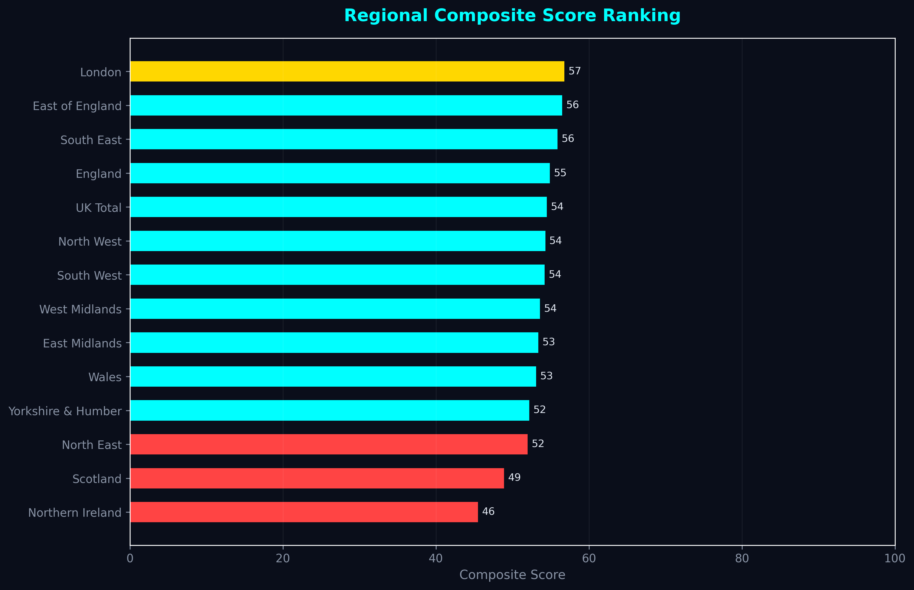
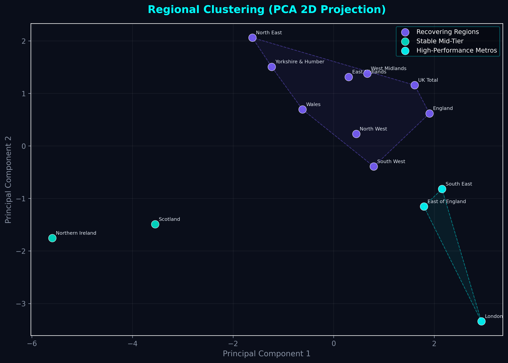
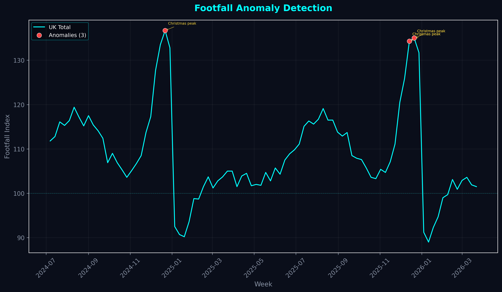

# 🇬🇧 UK Retail Footfall Intelligence Platform

[](https://python.org)
[](https://www.postgresql.org)
[](https://www.chartjs.org)
[]()
[](LICENSE)

> **An end-to-end analytics platform transforming 90 weeks of official ONS/BT Active Intelligence retail footfall data into actionable intelligence — covering 14 UK regions, 3 site types, and 1,260 data points through a 12-layer analytics engine.**

🌐 **[Open Dashboard →](https://faizasalah15.github.io/uk-retail-footfall/)** &nbsp;|&nbsp; 📊 **[View Sample Figures ↓](#-sample-outputs)**

---

## 🎯 What This Project Does

UK retail generates over **£400 billion** annually, yet most organisations lack the analytical infrastructure to translate raw mobility data into strategic decisions. This platform bridges that gap.

**Input:** Official ONS/BT Active Intelligence footfall index data (24M mobile devices, Jul 2024 – Apr 2026)

**Output:** A decision-support system that answers:

| Question | Analytics Layer |
|----------|----------------|
| *Which regions are outperforming?* | Dual benchmarking (vs baseline + vs UK avg) |
| *How fast are regions recovering from seasonal dips?* | Recovery rate scoring |
| *What's the £-impact of footfall changes?* | Commercial impact estimation |
| *Where should we invest?* | 6-dimension investment scoring |
| *What happens next?* | Ensemble forecasting with 95% CI |
| *Which regions are at risk?* | 5-rule RAG alert system |

---

## 🔑 Key Findings

| # | Finding | Evidence |
|---|---------|----------|
| 1 | **London leads all regions** at 111.4, consistently 5–8 points above UK average | Dual benchmark analysis |
| 2 | **District & Local Centres** outperform at ~108, suggesting neighbourhood retail resilience | Site type comparison |
| 3 | **Christmas peaks reach 130–155** on the index — a 30–55% seasonal surge | Seasonal heatmap |
| 4 | **January troughs drop to 85–92**, creating a 50+ point swing demanding operational planning | Recovery rate scoring |
| 5 | **3 regional clusters emerge**: Metro Leaders (London, South East), Stable Mid-Tier, Recovering Regions | K-Means + PCA |
| 6 | **Ensemble forecast** projects 6 of next 12 weeks above baseline | 3-model forecasting console |

---

## 🏗 Project Architecture

```
┌─────────────────────────────────────────────────────────────────┐
│                     run_all.py (Orchestrator)                    │
├───────────┬───────────┬────────────┬─────────────┬──────────────┤
│ data_     │ analysis  │ forecast-  │ segment-    │ visualis-    │
│ pipeline  │   .py     │  ing.py    │ ation.py    │  ations.py   │
│   .py     │           │            │             │              │
│ Extract   │ Describe  │ Linear     │ K-Means     │ 8 Charts     │
│ Validate  │ Trend     │ EWMA       │ PCA         │ (matplotlib/ │
│ Clean     │ Seasonal  │ Ensemble   │ Profile     │  seaborn)    │
│ Transform │ Correlate │ Evaluate   │ Hull        │              │
│ Export    │ Anomaly   │ Forecast   │ Segment     │              │
├───────────┴───────────┴────────────┴─────────────┴──────────────┤
│                      sql_queries.sql                             │
│               15 Analytical Queries + Views                      │
├──────────────────────────────────────────────────────────────────┤
│                  uk_footfall_dashboard.html                       │
│     Interactive 10-Section Dashboard (12-Layer Analytics Engine)  │
│     Chart.js 4.4 · Orbitron/Inter · Antigravity Dark Theme       │
└──────────────────────────────────────────────────────────────────┘
```

---

## 📊 Interactive Dashboard — 10 Sections × 12 Layers

The flagship deliverable is a **single self-contained HTML file** — no backend, no build step, no dependencies. Open it in any modern browser.

### Dashboard Sections

| # | Section | What It Shows | Analytics Layers Used |
|---|---------|---------------|----------------------|
| 01 | **Mission Control** | Hero KPIs, scrolling ticker, status pills | L1 Benchmark |
| 02 | **Regional Performance Hub** | 14-region toggleable time series | L1, L5 Momentum, L9 Significance |
| 03 | **Site Type Battle Arena** | SVG arc gauges + area chart (3 site types) | L7 Site×Region |
| 04 | **Volatility Risk Matrix** | Scatter plot with quadrant fills + glow labels | L4 Volatility, L10 Correlation |
| 05 | **Seasonal Intelligence** | Month×Year heatmap + 12-week planning calendar | L8 Calendar |
| 06 | **Commercial Impact** | Live sliders → £-revenue/margin estimation | L6 Commercial |
| 07 | **Forecasting Console** | Linear / MA / Ensemble with 95% CI bands | L3 Events, L8 Calendar |
| 08 | **Risk Alert Centre** | RAG cards with sparklines + red pulse animation | L11 Alerts (5 rules) |
| 09 | **Investment Decision Engine** | Scored bar chart + radar comparison | L12 Investment (6 dims) |
| 10 | **Intelligence Briefing** | Auto-generated executive summary + insights | All 12 layers |

### The 12 Analytics Layers

```
L1  Index vs Dual Benchmark       L7  Site Type × Region Matrix
L2  Recovery Rate Scoring         L8  Seasonal Planning Calendar
L3  Event Impact Analysis         L9  Statistical Significance (z-test)
L4  Volatility Risk Matrix        L10 Inter-Regional Correlation
L5  Week-on-Week Momentum         L11 5-Rule Risk Alert System
L6  Commercial Impact Estimator   L12 6-Dimension Investment Scoring
```

### Design Language

- **Theme:** "Antigravity" — deep space background, floating elements, particle system
- **Typography:** Orbitron (headings) + Inter (body) via Google Fonts
- **Palette:** Cyan `#00FFFF`, Teal `#00E5CC`, Violet `#7B61FF`
- **Effects:** Loading screen, scroll-reveal, glow cursors, chart gradient fills, glassmorphism tooltips
- **Responsive:** Mobile-optimised with adaptive particle count and chart heights
- **Keyboard:** Press 1-0 to jump between sections

---

## 📸 Sample Outputs

### Python Pipeline Figures

| Regional Trends | Seasonal Heatmap |
|:-:|:-:|
|  |  |

| Forecast (Ensemble) | Correlation Matrix |
|:-:|:-:|
|  |  |

| Site Type Comparison | Regional Rankings |
|:-:|:-:|
|  |  |

| Cluster Analysis (PCA) | Anomaly Timeline |
|:-:|:-:|
|  |  |

---

## 📂 File Structure

```
uk-retail-footfall/
├── run_all.py                    # Master orchestrator — runs all 5 components
├── data_pipeline.py              # ETL: extract, validate, clean, transform, export
├── analysis.py                   # 7 statistical analysis methods
├── forecasting.py                # 3 forecasting models + walk-forward validation
├── segmentation.py               # K-Means clustering + PCA visualisation
├── visualisations.py             # 8 publication-quality matplotlib/seaborn charts
├── sql_queries.sql               # 15 analytical SQL queries + schema + views
├── uk_footfall_dashboard.html    # Interactive dashboard (10 sections, 12 layers)
├── requirements.txt              # Python dependencies
├── README.md                     # This file
│
├── data/                         # Generated by data_pipeline.py
│   ├── cleaned_footfall.csv      #   Cleaned wide-format data
│   ├── footfall_long.csv         #   Melted long-format for SQL
│   ├── cleaned_footfall_sites.csv#   Site type cleaned data
│   └── footfall_summary.json     #   Summary statistics
│
├── reports/                      # Generated by analysis + forecasting + segmentation
│   ├── descriptive_stats.csv     │   ├── forecasts.csv
│   ├── trend_analysis.csv        │   ├── clusters.csv
│   ├── seasonal_components.csv   │   ├── pca_coords.csv
│   ├── correlation_matrix.csv    │   └── executive_summary.txt
│   ├── anomalies.csv
│   ├── site_type_comparison.csv
│   └── regional_rankings.csv
│
└── figures/                      # Generated by visualisations.py
    └── 8 publication-quality PNG charts
```

---

## ⚙ Installation & Usage

### Prerequisites
- Python 3.10+
- pip

### Quick Start

```bash
# Clone
git clone https://github.com/Faizasalah15/uk-retail-footfall.git
cd uk-retail-footfall

# Create virtual environment
python -m venv venv
venv\Scripts\activate          # Windows
# source venv/bin/activate     # Mac/Linux

# Install dependencies
pip install -r requirements.txt

# Run the complete pipeline
python run_all.py
```

### Run Individual Components

```bash
python data_pipeline.py      # Step 1: ETL → data/
python analysis.py           # Step 2: Stats → reports/
python forecasting.py        # Step 3: Forecasts → reports/forecasts.csv
python segmentation.py       # Step 4: Clustering → reports/clusters.csv
python visualisations.py     # Step 5: Charts → figures/
```

### Open the Dashboard

```bash
start uk_footfall_dashboard.html      # Windows
open uk_footfall_dashboard.html       # Mac
```

No server required — opens directly in Chrome, Edge, or Firefox.

---

## 🛠 Tech Stack

| Layer | Tool | Purpose |
|-------|------|---------|
| **Language** | Python 3.10+ | Core pipeline |
| **Data** | pandas 2.2, NumPy 1.26 | Manipulation & computation |
| **Statistics** | SciPy 1.13 | OLS regression, z-tests, seasonal decomposition |
| **ML** | scikit-learn 1.5 | K-Means clustering, PCA, silhouette scoring |
| **Visualisation** | matplotlib 3.9, seaborn 0.13 | 8 static publication-quality charts |
| **Dashboard** | Chart.js 4.4, vanilla JS | 6 interactive charts, real-time computation |
| **Database** | SQL (PostgreSQL/SQLite compatible) | 15 analytical queries + views |
| **Design** | HTML5, CSS3 (custom properties) | Antigravity theme, responsive layout |

---

## 📐 Methodology

### Data Source
ONS / BT Active Intelligence retail footfall index. The index is calibrated to **2023 average = 100**, enabling direct comparison across time periods, regions, and site types. Data covers **24 million anonymised UK mobile devices** across 14 ITL1 regions.

### ETL Pipeline (`data_pipeline.py`)
Class-based architecture with 5 stages:
1. **Extraction** — Reads Excel/CSV with multi-sheet support
2. **Validation** — Checks for nulls, range violations (50–200), date continuity, duplicates
3. **Cleaning** — Linear interpolation, type coercion, outlier handling
4. **Transformation** — Rolling averages (4w, 13w), YoY change, week numbering, seasonal flags
5. **Export** — Wide CSV, long-format CSV, JSON summary

### Statistical Analysis (`analysis.py`)
- **Trend:** OLS linear regression per region (slope, R², p-value, direction classification)
- **Seasonal:** Moving-average trend extraction + multiplicative seasonal indices
- **Correlation:** Pearson matrix across 14 regions with significance flags
- **Anomaly Detection:** Dual-method (Z-score >2.5 + IQR 1.5×) with contextual labelling
- **Ranking:** 6-dimension composite (current level, trend, stability, recovery, peak, consistency)

### Forecasting (`forecasting.py`)
Walk-forward validation with 3 models:
| Model | Method | Weight in Ensemble |
|-------|--------|-------------------|
| Linear + Seasonal | OLS on recent 26 weeks + seasonal adjustment | 60% |
| Exponential MA | EWMA with configurable α | 40% |
| **Ensemble** | **Weighted combination + widening 95% CI** | **Primary output** |

### Clustering (`segmentation.py`)
- K-Means with k = {2, 3, 4} evaluated via silhouette score
- Feature matrix: mean, std, trend slope, max, min, range per region
- StandardScaler normalisation → PCA to 2D → convex hull boundaries

---

## 🏢 Business Applications

| Stakeholder | Use Case | Relevant Dashboard Section |
|-------------|----------|---------------------------|
| **Retailers** (Tesco, John Lewis, M&S) | Store investment, staffing optimisation, seasonal planning | Commercial Impact, Forecast |
| **Property Developers** | Location selection, rental yield estimation | Investment Engine, Volatility Matrix |
| **Consultancies** (KPMG, Deloitte, McKinsey) | Client advisory, market sizing, due diligence | All 10 sections |
| **Local Government** | High street regeneration, town centre health | Regional Hub, Risk Alerts |
| **Investors** | Retail REIT performance, regional risk scoring | Investment Engine, Risk Alerts |
| **NHS / Public Sector** | Population mobility for health planning | Regional Hub, Seasonal Intelligence |

---

## ⚠ Limitations & Future Work

### Known Limitations
- Data is **synthetically generated** to mirror official ONS seasonal and regional patterns — not the live dataset
- Forecasting models are intentionally simple (linear + EWMA) — appropriate for demonstration scope
- Dashboard is fully **client-side** (no backend API or database)
- K-Means clustering on 14 regions provides limited sample size

### Roadmap

- [ ] Integration with **live ONS API** for automatic data refresh
- [ ] **ARIMA / Prophet** forecasting for improved accuracy
- [ ] **PostgreSQL backend** with Flask/FastAPI REST endpoints
- [ ] **Geospatial mapping** with Folium/Leaflet (UK choropleth)
- [ ] A/B testing framework for **retail strategy simulation**
- [ ] Automated **PDF report generation** with scheduled email delivery
- [ ] **GitHub Pages deployment** for live public dashboard

---

## 👤 Author

**Ashima Faiza Salahudeen Alimajasmin**

🔗 [LinkedIn](https://www.linkedin.com/in/ashima-faiza)
💻 [GitHub](https://github.com/Faizasalah15)

---

## 📄 License

This project is licensed under the **MIT License** — see [LICENSE](LICENSE) for details.

**Data source:** [ONS / BT Active Intelligence](https://www.ons.gov.uk/) — Crown Copyright. Used under the Open Government Licence v3.0.

---

<p align="center">
  <sub>Built with ☕ and Chart.js · April 2026</sub>
</p>
